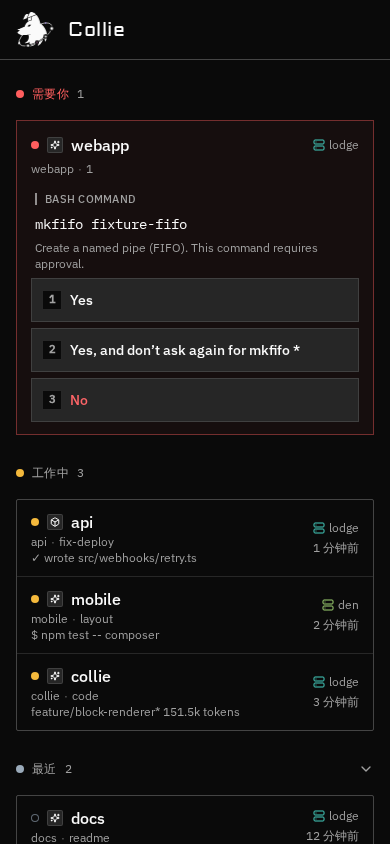

# Collie for Android

Collie 是一个 **interrupt handler**，不是手机上的终端。

agent 卡住的时候，选项直接出现在卡片上——编号、一按就批。打开 pane 才是打字、按键、快捷指令。通知栏同样可以批准 / 拒绝，不用打开应用。

本仓库是 Kotlin + Jetpack Compose 的安卓实现，语言和信息架构沿自 [AltanS/collie](https://github.com/AltanS/collie)，按手机交互改过：三秒决定在卡片上完成，pane 留给真正要动手的时候。

| | |
|---|---|
| 包名 | `com.collie.app` |
| 版本 | 1.2.0 |
| minSdk | 26（Android 8） |
| 语言 | 默认中文 |
| 安装包 | [collie.apk](https://collie-android.vercel.app/collie.apk) |

在 Android Studio 里打开 **`android/`** 目录，不是仓库根。

## 产品

三个 tab：

- **牧群** — 需要你（卡片）/ 工作中（扁行）/ 最近
- **机群** — 主机、副机、同伴
- **我的** — 语言、触感、指纹锁、小组件预览

需要你的 Ask 卡上直接带选项，不先跳进 pane。Keys / Quick / Agent 内嵌在 composer 上方，不是盖住终端的浮层。指纹锁是可选的，Herd 上的批准不经过这道门。

Herd 数据是演示（未接 Herdr 桥）。系统通知、通知栏操作、前台服务、桌面小组件是真的。



## 构建

需要 JDK 17 和 Android SDK 34。

```bash
cd android
echo "sdk.dir=$ANDROID_HOME" > local.properties
./gradlew :app:assembleDebug
```

产物：`android/app/build/outputs/apk/debug/app-debug.apk`。

侧载时允许未知来源。当前包是 debug 签名，用来装到真机上试用。

## 源码结构

```
android/app/src/main/java/com/collie/app/
  MainActivity.kt          入口、状态栏、分享 intent
  CollieApplication.kt     通知渠道、前台服务
  data/Models.kt           Agent / Ask / 机群
  data/HerdRepository.kt   牧群状态（演示数据）
  ui/CollieApp.kt          全部界面
  ui/theme/Theme.kt        2px 圆角、amber 工作中、host 色
  notify/                  通知栏批准 / 拒绝、HerdService
  widget/HerdWidget.kt     桌面「需要你」小组件
```

视觉约定：圆角 2px（除等宽圆点）、chrome 是页面加分割线不是色带、卡住的是卡片、工作中 / 最近是扁行、工作中颜色 `oklch(0.82 0.15 82)` / `#E0B44A`、host 色只画在 glyph 上。

## 许可

界面语言和 Collie 标记来自 [AltanS/collie](https://github.com/AltanS/collie)。本仓库是独立的安卓重写。
